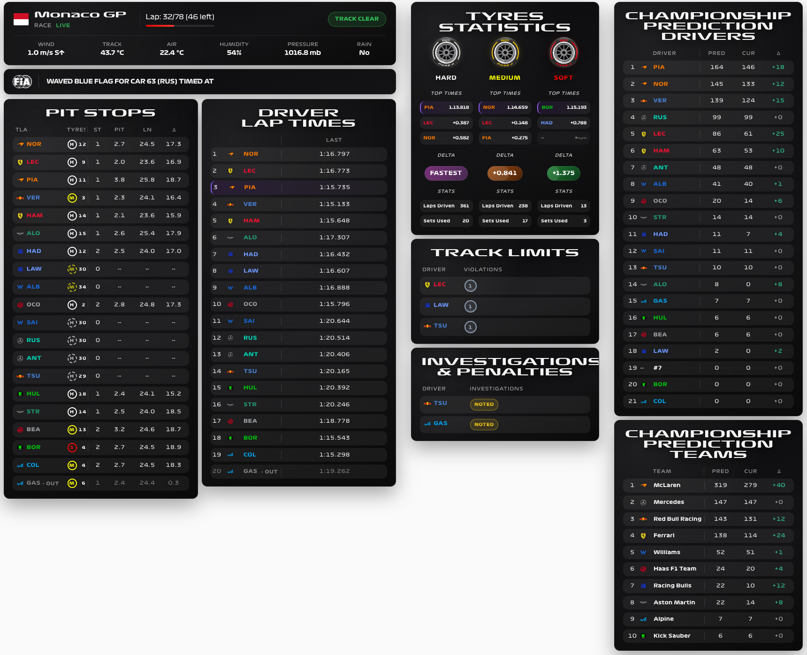

# F1 Sensor for Home Assistant

Bring Formula 1 into your home with race schedules, live timing, dashboard cards and automations. Follow a session live, align updates with your TV broadcast, or play archived timing data alongside a replay.

[Documentation](https://nicxe.github.io/f1_sensor/) · [Installation](https://nicxe.github.io/f1_sensor/getting-started/installation) · [Dashboard cards](https://nicxe.github.io/f1_sensor/cards/cards-overview) · [Releases](https://github.com/Nicxe/f1_sensor/releases)

## Start with your next race

1. [Install with HACS](https://nicxe.github.io/f1_sensor/getting-started/installation) and restart Home Assistant.
2. [Add and configure F1 Sensor](https://nicxe.github.io/f1_sensor/getting-started/add-integration).
3. [Build your first dashboard](https://nicxe.github.io/f1_sensor/getting-started/first-dashboard) with the Next Race card. No active session is needed.

Dashboard card resources are bundled and registered automatically. Live information appears when the relevant session streams are available; schedules, standings and results have their own update cycles.

## Make race day your own

| I want to… | Start here |
| --- | --- |
| Choose a dashboard card | [Visual card catalogue](https://nicxe.github.io/f1_sensor/cards/cards-overview) |
| Match updates to my TV | [Live Delay](https://nicxe.github.io/f1_sensor/features/live-delay) |
| Watch a completed session | [Replay Mode](https://nicxe.github.io/f1_sensor/features/replay-mode) |
| Make my lights react to flags | [Track Status Light blueprint](https://nicxe.github.io/f1_sensor/blueprints/track-status-light) |
| Understand a sensor or event | [Entity and event reference](https://nicxe.github.io/f1_sensor/reference/overview) |
| Work out why data is missing | [Help and troubleshooting](https://nicxe.github.io/f1_sensor/help/overview) |

Core schedule and public timing features work without F1TV authentication. Some detailed live streams need [F1TV Auth](https://nicxe.github.io/f1_sensor/features/f1tv-auth); requirements are listed on each card and entity page. Availability depends on the selected mode, enabled features and upstream data.

## Community and contributions

Find [community dashboards](https://nicxe.github.io/f1_sensor/example/overview), ask in [GitHub Discussions](https://github.com/Nicxe/f1_sensor/discussions), or [report a reproducible problem](https://github.com/Nicxe/f1_sensor/issues). To contribute code or documentation, start with [CONTRIBUTING](CONTRIBUTING.md).

The `dev` branch can include features awaiting stable release. Use the release linked by the documentation version label when matching instructions to your installation.

You can also [support development](https://nicxe.github.io/f1_sensor/support) through sponsorship, documentation improvements and helping other users.

> F1 Sensor is an unofficial project and is not associated in any way with the Formula 1 companies. F1, FORMULA ONE, FORMULA 1, FIA FORMULA ONE WORLD CHAMPIONSHIP, GRAND PRIX and related marks are trade marks of Formula One Licensing B.V.
