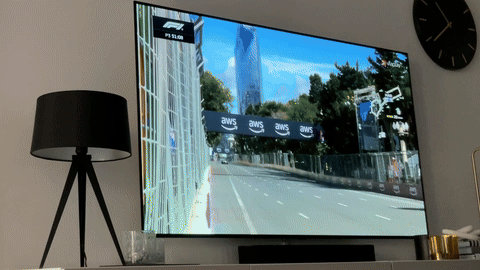
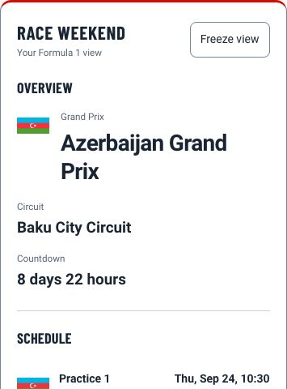

# F1 Sensor for Home Assistant

## Your home. On race time.

Turn your Home Assistant dashboard into a personal pit wall and let your home follow the action. F1 Sensor brings Formula 1 schedules, live timing, race updates and results into Home Assistant, with one configurable dashboard card and automations you can make your own.

See when the next session starts, follow the drivers as they race, and make your lights react when the flags change. Watching on a delayed broadcast or catching up later? Match live updates to your TV with Live Delay, or bring archived timing to life with Replay Mode.

[Documentation](https://nicxe.github.io/f1_sensor/) · [Installation](https://nicxe.github.io/f1_sensor/getting-started/installation) · [Dashboard card](https://nicxe.github.io/f1_sensor/cards/cards-overview) · [Releases](https://github.com/Nicxe/f1_sensor/releases)

## Yellow flag. Yellow light.

A yellow flag on TV, a yellow light in your living room. When track conditions change, your room can follow: green for clear racing, yellow for caution, red for a red flag, and distinct colors for Safety Car and Virtual Safety Car.

Use the [Track Status Light blueprint](https://nicxe.github.io/f1_sensor/blueprints/track-status-light) to connect an RGB light or light group in Home Assistant. Choose when it should react with presence, TV and quiet-hour conditions, or use WLED presets and playlists for your own effects. Set [Live Delay](https://nicxe.github.io/f1_sensor/features/live-delay) to align the changes with your broadcast.

Lights are just the start. Get a reminder before a session, receive selected Race Control messages, or trigger your own actions when your favorite driver gains a place or enters the pits. Explore the [automation guides and blueprints](https://nicxe.github.io/f1_sensor/automation) for ideas you can use at home.

## Your personal pit wall

Keep the race weekend beside your TV, on a tablet, or wherever you use Home Assistant. Start with a next-race countdown and build up to a dashboard with driver positions, lap times, gaps, tyres, weather and Race Control messages.

| Follow the weekend | What you can do |
| --- | --- |
| Before the lights go out | Check the season calendar, session times, circuit weather and championship standings. |
| During the session | Follow practice, qualifying, Sprint and Race timing, with track flags, tyre information and Race Control updates. |
| Follow your driver | Select a [Favorite Driver](https://nicxe.github.io/f1_sensor/features/favorite-driver) for focused timing and automations based on their position and pit activity. |
| After the chequered flag | Review results, explore the [Historical archive](https://nicxe.github.io/f1_sensor/features/historical-results), and see how the championship develops. |

The dashboard card is included with the integration and registered automatically. [Explore its presets and modules](https://nicxe.github.io/f1_sensor/cards/cards-overview) to build the view that suits your setup.

## Watch on your time

**Watching live?** Use [Live Delay](https://nicxe.github.io/f1_sensor/features/live-delay) to match timing updates, lights and notifications to your TV or stream. Adjust the delay yourself or use guided calibration to find the offset.

**Watching later?** Turn on [No Spoiler Mode](https://nicxe.github.io/f1_sensor/features/no-spoiler-mode) before the session to hold back supported spoiler-sensitive updates in F1 Sensor. When archive data is available, load the completed session in [Replay Mode](https://nicxe.github.io/f1_sensor/features/replay-mode) and align it with your recording so your dashboard and automations follow along. Replay Mode plays timing data; you provide the race video.

## Start with your next race

1. [Install with HACS](https://nicxe.github.io/f1_sensor/getting-started/installation) and restart Home Assistant.
2. [Add and configure F1 Sensor](https://nicxe.github.io/f1_sensor/getting-started/add-integration).
3. [Build your first dashboard](https://nicxe.github.io/f1_sensor/getting-started/first-dashboard) with the Next Race card. No active session is needed.

Start with schedules and public live timing without F1TV authentication. Optional [F1TV Auth](https://nicxe.github.io/f1_sensor/features/f1tv-auth) adds access to extra live features such as Track Map, Pit Stops, Team Radio and Championship Prediction when the source provides the data.

Live information appears when the relevant session streams are available; schedules, standings and results have their own update cycles. Each card and feature guide explains its requirements, including which features need optional access and what is available in replay.

## Make race day your own

| I want to… | Start here |
| --- | --- |
| Build a dashboard card | [F1 Sensor card](https://nicxe.github.io/f1_sensor/cards/cards-overview) |
| Match updates to my TV | [Live Delay](https://nicxe.github.io/f1_sensor/features/live-delay) |
| Watch a completed session | [Replay Mode](https://nicxe.github.io/f1_sensor/features/replay-mode) |
| Make my lights react to flags | [Track Status Light blueprint](https://nicxe.github.io/f1_sensor/blueprints/track-status-light) |
| Understand a sensor or event | [Entity and event reference](https://nicxe.github.io/f1_sensor/reference/overview) |
| Work out why data is missing | [Help and troubleshooting](https://nicxe.github.io/f1_sensor/help/overview) |

## Community and contributions

Find [community dashboards](https://nicxe.github.io/f1_sensor/example/overview), ask in [GitHub Discussions](https://github.com/Nicxe/f1_sensor/discussions), or [report a reproducible problem](https://github.com/Nicxe/f1_sensor/issues). To contribute code or documentation, start with [CONTRIBUTING](CONTRIBUTING.md).

The `dev` branch can include features awaiting stable release. Use the release linked by the documentation version label when matching instructions to your installation.

You can also [support development](https://nicxe.github.io/f1_sensor/support) through sponsorship, documentation improvements and helping other users.

> F1 Sensor is an unofficial project and is not associated in any way with the Formula 1 companies. F1, FORMULA ONE, FORMULA 1, FIA FORMULA ONE WORLD CHAMPIONSHIP, GRAND PRIX and related marks are trade marks of Formula One Licensing B.V.
