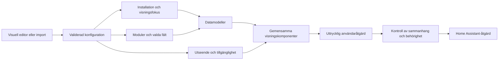

# Kontrakt för det modulära F1-kortets konfiguration

Datum: 2026-09-15. Konfigurationsversion: **2**. Status: teknisk specifikation för den lokala implementationen, med uttryckligt avgränsade återstående produktkrav.

Detta dokument hör till planens A3. Det specificerar konfiguration, modulgränser, grafisk stil och tillgänglighet. Det är inte ett besked om att hela kortplattformen, migrationen eller testmatrisen är färdig. Referensen för vad version 2 faktiskt accepterar är [config.js](../custom_components/f1_sensor/www/f1-sensor-live-data-card/modular/config.js), tillsammans med [catalog.js](../custom_components/f1_sensor/www/f1-sensor-live-data-card/modular/catalog.js). Bilagan nedan är hämtad från dessa filer.

## 1. Fyra separata delar

| Del | Äger | Ska inte ändra |
| --- | --- | --- |
| Innehåll | Modulernas typer, fältordning, filter och innehållsalternativ | Grafisk stil, tillgänglighetsval eller integrationsinställningar |
| Sammanhang | Vald installation och förvalt eller tillfälligt förar-/teamfokus | Uppspelning, Live Delay eller globalt spoilerskydd utan en uttrycklig åtgärd |
| Utseende | Typografi, ytor, dekorativa färger, identitetsgrafik och informationstäthet | Datakälla, värde, sortering eller betydelsen av timingstatus |
| Tillgänglighet | Alternativ till färg, kontrast, rörelse och uppläsning | Användarens innehåll, valda förare eller rådata |

Väderjämförelse och Tävlingshelgen innehåller ett automatiskt aktuellt väderblock och en separat raceprognos. Båda kan redigeras eller tas bort oberoende.

En innehållsmall kopieras till en vanlig modulkonfiguration. Kortet sparar ingen levande referens till en levererad mall. Ett senare mallbyte ersätter modulerna efter granskning i editorn och behåller övriga kortinställningar. Ändringar i en levererad mall skriver därför inte om redan sparade kort.



## 2. Sparad konfiguration och tillfälligt tillstånd

| Tillstånd | Var det hör hemma | Livslängd |
| --- | --- | --- |
| Kortets inställningar | Home Assistants dashboardkonfiguration | Sparas först med HA:s Spara |
| Editorns pågående ändringar | Editor och dess `config-changed`-händelser | Kan avbrytas; högst 40 steg i editorns egen ångrahistorik |
| Standardförare och standardteam | `context.driver` och `context.team` | Sparas med kortet |
| Låst förare eller team i en modul | Modulens `driver` och `team` | Sparas med kortet |
| Kortets eller modulens sessionsurval | `context.selection` respektive `modules[].selection` | Sparas med kortet; ett lås startar inte en livekälla eller replay |
| Modulens fasprofil | `modules[].when` | Sparas med kortet; automatiska fasbyten skriver inte om konfigurationen |
| Ett förarval i det visade kortet | Kortets visningsfokus, eller dess kontrollgrupp | Tillfälligt; skriver inte dashboardkonfigurationen |
| Vald flik, Visa alla och interaktiva diagram-/arkivval | Kortets lokala tillstånd | Återställs vid ny kortinstans eller relevanta konfigurationsbyten |
| Frys vyn | En lokal kopia av visningsmodellerna | Endast detta kort; pausar inte backend |
| Behåll sparad data | Kortets tillfälliga uppsättning mottagna källdata | Försvinner vid borttagning/omladdning och ogiltigförklaras vid relevanta sammanhangsbyten |
| Replay, Live Delay och globalt spoilerskydd | Integrationens entiteter och tjänster | Delat enligt respektive integrationskontroll |

Inspelningar, livevärden, anslutningar och abonnemang ska inte serialiseras i kortkonfigurationen. Språk och generellt 12/24-timmarsformat hämtas från HA-profilen. Ett schema kan uttryckligen välja hemmatid, bantid eller UTC.

## 3. Rotobjektet i version 2

Tabellen beskriver normaliserade värden. Den inkommande konfigurationen får utelämna inställningar som har standardvärden. Normaliseringen kopierar konfigurationen och ändrar inte anroparens objekt.

| Egenskap | Typ och standard | Betydelse |
| --- | --- | --- |
| `type` | `custom:f1-sensor-card` | Enda korttypen som denna normaliserare accepterar |
| `version` | Heltalet `2` | Konfigurationsformat; separat från integrationsversion och resursens cacheversion. Giltig version 1 migreras framåt vid normalisering. |
| `title` | Text, `F1 Sensor` | Kortets rubrik; tom text är tillåten |
| `f1_entry_id` | Text, tom | Tomt väljer automatiskt endast när exakt en installation upptäckts. Flera installationer kräver ett uttryckligt val. |
| `layout` | `stack` eller `tabs`, standard `stack` | Samma modulmodeller används i båda layouterna |
| `modules` | Lista, standard helgmallen | Ordningen är visningsordningen. Tom lista ger ett tomt kort med vägledning. Högst 64 moduler. |
| `appearance` | Objekt | Kortgemensamma grafiska inställningar enligt avsnitt 5 |
| `styles` | Valfri CSS-text, högst 32 768 tecken | Kortlokal avancerad styling enligt avsnitt 5. JavaScript-mallar, `@import` och `url()` accepteras inte. |
| `accessibility` | Objekt | Kortgemensamma tillgänglighetsval enligt avsnitt 6 |
| `context` | Objekt | Installationens visningssammanhang enligt avsnitt 7 |
| HA:s åtgärdsegenskaper | JSON-värden, exempelvis `entity`, `tap_action`, `hold_action`, `double_tap_action` | Förmedlas genom den gemensamma HA-åtgärdshanteringen. `entity` är ett åtgärdsmål, inte ersättning för F1-installationsvalet. |
| `migration` | JSON-objekt när ett gammalt kort konverterats | Bevarat original och konverteringsunderlag för granskning/återställning |
| Okända egenskaper | Kopierbara JSON-värden | Bevaras för återställning och vidare redigering; innebär inte att version 2 implementerar deras funktion |

En saknad vald installation får inte tyst ersättas av en annan. Entitets-id för F1-data upptäcks via vald installation och ska inte behöva kopieras av användaren.

## 4. Modulobjekt och modulgränser

| Egenskap | Typ och standard | Regel |
| --- | --- | --- |
| `id` | Text; skapas om den saknas eller är tom | Unik inom kortet, 1–100 tecken ur bokstäver, siffror, bindestreck och understreck. Bevaras vid flytt. Duplicering skapar nytt id. |
| `type` | Obligatorisk text | Ett modul-id från bilagan, eller en okänd typ som ska bevaras med förklaring |
| `title` | Text, tom | Tomt använder modulens översatta standardrubrik |
| `enabled` | Boolesk, `true` | Avstängda moduler finns kvar i konfiguration och editor |
| `show_header` | Boolesk, `true` | Visar modulrubriken; tar inte bort meningsfull sessions-/statusinformation |
| `show_table_header` | Boolesk, `true` | Synliga kolumnrubriker där det stöds; åtkomliga kolumnnamn behålls |
| `fields` | Lista av unika text-id; standard från modul/profil | Bestämmer innehåll och ordning. Tom lista ska inte återfylla standardkolumner. Okända id bevaras med varning. |
| `unavailable` | `explain`, `retain`, `hide`; standard `explain` | Förklaring, sparad data eller dold modul när data saknas; får aldrig åsidosätta spoilerskydd |
| `focus_mode` | `inherit`, `independent`; standard `inherit` | Följ kortets fokus eller använd enbart modulens egna förar-/teamfilter |
| `selection` | Typat objekt; standard `{mode: inherit}` | Ärver kortets session, följer en vald källa eller låser en stabil sessionsidentitet |
| `when` | Unik lista av `before`, `active`, `finished`, `unknown`; standard alla | Styr i vilka sessionsfaser modulen visas. Tom lista döljer utan att radera modulen. |
| `driver` | Text, tom | Låst modulval; tomt ärver kortets fokus i `inherit` och omfattar alla i `independent` |
| `team` | Text, tom | Låst modulval; tomt ärver kortets fokus i `inherit` och omfattar alla i `independent` |
| `options` | Objekt | Modulens innehålls- och presentationsval enligt bilagan |
| Okända egenskaper | JSON-värden | Bevaras; ska inte exekveras eller tappas vid stilbyte/import/export |

Modulgränsen går vid ett avgränsat innehåll med egen fältlista och datamodell. Samma timingmodul används ensam eller tillsammans med andra moduler. Det finns ingen fri nästling av moduler i version 2.

Modulregistret anger fält, standardval, källor, fokusstöd och eventuell ström. Datamodellen hanterar datatolkning, sortering, filter, tomma värden och sammanhang. Visningskomponenten presenterar modellen och skickar uttryckliga användarhändelser. Den ska inte själv uppfinna en ny tolkning av ett tidsvärde eller göra en integrationsändring från en renderingsuppdatering.

Källistorna i bilagan beskriver modulens möjliga källor. De är inte ett löfte att samtliga hämtas eller används samtidigt. Aktuell innehållsvariant avgör vilka källor som används. Replay- och arkivval är olika operationer: ett historiskt resultatval startar inte replay.

### Fält, profiler och beroenden

Fält-id är del av konfigurations-API:t. Etikett, semantik, enhet, datatäckning, källväg och tillåtna presentationer hör till fältkatalogen. En UI-etikett kan översättas utan att det sparade fält-id:t ändras.

Timing med automatisk sessionsprofil beräknar effektiva kolumner för sessionstypen. När användaren ändrar kolumner eller ordning i editorn övergår profilen till egna kolumner. Arkivets klassificeringsprofiler har motsvarande explicit hantering. Ett uttryckligt tomt eller anpassat fälturval får inte förväxlas med att inget urval ännu sparats.

Låsta modulval har företräde framför kortets fokus, var för sig för förare och team. `focus_mode=independent` kopplar bort båda ärvda filtren; bara modulens egna filter används. Valet visas i editorn där modulen stöder förar-/teamfokus och märks Eget urval i kortet. Det ändrar inte vald session, replay eller integrationsinställningar. Om båda begränsningarna används kombineras filtren; ett tomt resultat får inte tyst breddas. Aggregerad data kan sakna förarfilter: exempelvis kan sammanlagd däckstatistik inte delas upp per förare i efterhand.

## 5. Grafisk modell och prioritet

| Egenskap | Tillåtna värden | Standard |
| --- | --- | --- |
| `style` | `f1`, `ha`, `minimal` | `f1` |
| `mode` | `auto`, `light`, `dark` | `auto` |
| `font` | `auto`, `f1`, `system` | `auto` |
| `density` | `comfortable`, `compact`, `spacious` | `comfortable` |
| `surface` | `style`, `framed`, `soft`, `flat` | `style` |
| `accent_mode` | `style`, `neutral`, `f1`, `team`, `custom` | `style` |
| `accent` | Sexsiffrig hex-färg | `#e10600` |
| `accent_team` | Teamnamn eller tom text | tom |
| `logo_style` | `auto`, `color`, `white`, `mono` | `auto` |
| `logo_size` | `small`, `normal`, `large` | `normal` |
| `tyre_style` | `ring`, `image`, `text`, `both` | `ring` |
| `numbers` | `tabular`, `inherit` | `tabular` |
| `show_header`, `logos`, `flags`, `team_colors` | Booleska | `true` |
| `full_names` | Boolesk | `false` |
| `palette` | Objekt med sexsiffriga hex-färger | tomt objekt |

Prioriteten är följande:

1. `mode=auto` följer HA:s temaläge, med webbläsarens färgschema som reserv. Ett uttryckligt ljust/mörkt läge gäller detta kort.
2. Stilen väljer grundutseendet. Uttryckliga val av font, yta, accent och logotypstil kompletterar det utan att radera sparade val.
3. `font=auto` använder F1-typografin i F1-stilen och systemtypografi i övriga stilar.
4. Teamaccent använder det valda teamets tillgängliga färg. Saknad eller tvetydig färg ger neutral reserv; ingen godtycklig teamfärg gissas.
5. Dekorativ accent och teamfärger ändrar inte betydelsen av timingfärger. `palette` gäller de semantiska statusnycklar som renderaren stöder; okända giltiga färgnycklar bevaras men får ingen uppfunnen betydelse.
6. Hög kontrast och systemets forced-colors måste kunna göra innehållet läsbart även när dekorativa färger inte kan behållas. Egna färger behålls i konfigurationen.

Versionsgräns: version 2 har kortgemensamt utseende, separata visningsval för
modul-/tabellrubriker och valfri kortlokal CSS i `styles`. CSS tillämpas efter det
beräknade standardutseendet och begränsas av kortets Shadow DOM. Dokumenterade
`--f1-*`-variabler, modulernas `data-module-type`/`data-module-id` och offentliga
Shadow Parts utgör det stabila stylingkontraktet; privata klassnamn gör det inte.
Det finns ingen JavaScript-utvärdering, extern CSS-import eller separat fullständig
stilprofil per modul. Fältens presentationsval, exempelvis tabell eller diagram,
ligger i respektive moduls `options`.

## 6. Tillgänglighetsmodell

| Egenskap | Värden | Standard och innebörd |
| --- | --- | --- |
| `high_contrast` | Boolesk | `false`; explicit högkontrastutförande när påslaget |
| `signals` | `shape`, `text`, `both` | `shape`; alternativ till enbart färgtolkning |
| `motion` | `system`, `reduced` | `system`; följer systemets önskemål, medan `reduced` alltid minskar rörelse |
| `announce` | Boolesk | `true`; möjliggör kontrollerade statusmeddelanden, inte uppläsning av varje timingcell |

Färg, symbol och text beskriver samma underliggande status. En annan färgpalett får inte vända betydelsen av en pil eller ändra vilket varv som jämförs. Flaggor, teamloggor och däckbilder ska ha en textmässig eller semantisk motsvarighet och en fungerande reserv när bilden saknas.

Tangentbordsfokus och skärmläsarnamn ska fungera även när synliga rubriker döljs. Diagram ska ha åtkomliga dataalternativ. Reducerad rörelse eller forced-colors ska inte skriva tillbaka nya konfigurationsvärden. Det finns inget tillgänglighetsval som gör data beroende av enbart färg. Att dessa regler är specificerade är inte bevis för att hela enhets- och skärmläsarmatrisen är verifierad.

## 7. Sammanhang, kontrollgrupper och integrationsåtgärder

| Egenskap | Värden och standard | Omfattning |
| --- | --- | --- |
| `driver`, `team` | Text, tom | Kortets startfokus |
| `scope` | `local` eller `group`, standard `local` | Tillfälliga fokusval |
| `group` | Text, tom | Kräver ett namn med minst ett icke-blankt tecken när `scope=group` |
| `selection` | Följläge eller låst sessionsidentitet; standard `{mode: follow, source: auto}` | Kortets sparade sessionssammanhang |
| `share` | Unik lista ur `focus`, `selection`; standard `focus` | Anger vilka tillfälliga visningsval som får delas i kontrollgruppen |
| `spoilers` | `inherit` eller `hide`, standard `inherit` | Följer globalt skydd eller döljer alltid i detta kort |
| `viewing_controls` | Boolesk, `false` | Visar uttryckliga Live Delay-/spoilerkontroller |

En kontrollgrupp adresseras av anslutning, F1-installation, dashboard, vy och trimmat gruppnamn. Version 2 delar förar-/teamfokus och kan uttryckligen dela ett tillfälligt sessionsurval. Ett låst kort behåller sitt sparade urval. Gruppen är lokal till den aktuella webbläsaranslutningen; den är inte en synkroniseringstjänst mellan telefoner eller användare. Gruppen försvinner när dess sista deltagare lämnar den och kan aldrig publicera replay-, Live Delay- eller automationskommandon.

Globalt spoilerskydd har företräde framför modulval, kortets lokala visningsfokus och sparade modeller. Okänt skyddstillstånd ska inte behandlas som att skyddet är av. Lokalt `hide` kan inte användas för att stänga av globalt skydd.

Live Delay gäller vald installation och dess liveleverans/automationer. Globalt spoilerskydd gäller alla F1-installationer. Replay styr installationens gemensamma spelare. Kortets visningsfokus, flikar och frysning ska inte ändra dessa tillstånd. Servicekommandon kontrolleras igen mot aktuell installation och aktuellt sammanhang när användaren aktiverar dem; ett gammalt knapptryck får inte tillämpas efter ett sessionsbyte.

## 8. Validering, okända inställningar och versioner

| Fall | Kontrakt i version 2 |
| --- | --- |
| Saknade standardiserade egenskaper | Fylls i utan att anroparens objekt muteras |
| Fel typ eller känt alternativ utanför tillåtet intervall | `ConfigurationError` med sökväg, exempelvis `modules.0.options.rows` |
| Okänd modul | Behåll alla inställningar, visa förklaring i modulens plats och låt kända moduler fungera |
| Okänt fält i en känd modul | Bevara fält-id och visa varning; påstå inte att innehållet stöds |
| Okänd rot-/options-/utseendeegenskap | Bevara JSON-värdet; det finns inte automatiskt en varning för varje okänd egenskap |
| Giltig konfigurationsversion `1` | Migrera till version 2 med följläge, ärvt modulurval, alla faser och endast fokusdelning; ändra inte fält |
| Okänd konfigurationsversion | Avvisa; tolka inte som version 2 och nedgradera inte automatiskt |
| Dubbla modul-id eller fältnamn | Avvisa med inställningssökväg |
| Icke-JSON-värden, obegränsade tal eller reserverade prototypegenskaper | Avvisa vid kopiering |
| För djup nästling | Kopieringen avvisar djup större än 40 |
| Felaktig import | Behåll editorns tidigare giltiga konfiguration; visa felet |
| Export/import | Normaliserad, oberoende JSON-kopia som bevarar okända egenskaper |

Importens nuvarande längdgräns är 512 000 enligt JavaScripts stränglängd, alltså inte en exakt UTF-8-bytebudget. Kontraktets 64 moduler är en valideringsgräns, inte ett löfte om att en dashboard med 64 tunga livevyer blir användbar på varje enhet. `source_list` och `source_choice` behåller sparade text-id även när alternativet för tillfället inte finns i källan; statiska enum-/listval kontrolleras mot katalogen.

`lap_selections` tillåter högst fyra unika par i formatet `förarnummer:varv`: förarnummer 1–99 och varv 1–500, utan inledande nollor. Det är en urvalsgräns för den befintliga telemetrifunktionen, inte ett antagande om antalet deltagare i en session.

Ett ogiltigt nytt värde får inte göra att editorn ersätter en fungerande konfiguration med tomma standardvärden. Återställning av ett konverterat gammalt kort är en uttrycklig operation som använder det sparade originalet, inte en automatisk följd av ett renderingsfel.

En framtida ändring av betydelsen hos ett befintligt fält kräver en uttrycklig migrering och ny konfigurationsversion. Ett nytt alternativ som äldre kort inte förstår får inte ges samma versionsnummer enbart därför att gamla normaliserare råkar bevara den okända egenskapen. Integrationsrelease, modulernas konfigurationsversion och cachebrytande resursversion ska hållas isär.

## 9. Implementerat versionskontrakt och återstående målbild

Tabellen skiljer de nu implementerade version-2-gränserna från produktkrav som fortfarande behöver bredare datastöd eller acceptans.

| Återstående förmåga | Specificerad gräns och regel | Implementation/acceptans |
| --- | --- | --- |
| Låst säsong, evenemang och session | Ett typat urval skiljer följ aktuell session från ett uttryckligt urval. Ett explicit urval bär stabil säsongs-/mötes-/sessionsidentitet och dataläge. Modulens lås har företräde framför kortets urval. | Implementerat i version 2 för matchande live/replay samt arkivmodulen; otillgänglig identitet behålls utan reservbyte |
| Låsta jämförelser | Varje jämförelse behåller egen identitet. Ett ändrat förarfokus får inte skriva över ett sessionslås. | Implementerat genom modulens eget urval och prioriteringsregeln; ytterligare historiska datamoduler kräver egna arkivadaptrar |
| Historiskt urval och replay | Historik är en läsning. Att ladda/starta replay är en separat, uttrycklig integrationsåtgärd. Ett sessionslås får inte starta ytterligare oberoende liveanslutningar eller spelare. | D1, D5, E3 |
| Utökat delat sammanhang | Varje ytterligare delat värde behöver uttrycklig omfattning och konfliktregel. Standard ska fortsatt vara lokalt. Två användare/enheter får inte oavsiktligt dela en integrationskontroll via fokusgruppen. | Version 2 kan uttryckligt dela `selection` inom samma anslutning; cross-device-delning är inte implicit i gruppnamnet |
| Personliga mallar | En egen mall är en kopia av en granskad konfiguration, inte en länk som kan skriva över andra kort. Import visar vad som ersätts, behåller originalet för ångra och kräver ett nytt uttryckligt installationsval när den sparade installationen saknas. | D5; namngiven fil-/textimport och export är implementerad, automatisk synkronisering ingår inte |
| Sammanhang för kombinerad data | Fält ska bära gemensam identitet och generation där data kombineras. Mottaget samtidigt i webbläsaren är inte samma sak som observerat samtidigt hos källan. | A1/E4/E5; sparade källdata ersätter inte backendkontraktet |
| Komplett gammal konfiguration | Varje gammalt alternativ behöver verifierad motsvarighet, uttryckligt reservbeteende eller dokumenterat bortval. Okänd JSON som bevaras är återställningsskydd, inte funktionsparitet. | A2/F2 |

### Implementerad modell för konfigurationsversion 2

Version 2 inför generellt sessionsurval och fasstyrning. Följande nycklar valideras av normaliseraren och exponeras i den visuella editorn:

| Sökväg | Form och standard | Regel |
| --- | --- | --- |
| `context.selection` | Objekt; standard `mode=follow`, `source=auto` | Följ aktivt sammanhang eller lås ett uttryckligt sammanhang |
| `modules[].selection` | Objekt; standard `mode=inherit` | Ärver kortet, följer aktuell session uttryckligen eller låser en egen jämförelse |
| `context.share` | Unik lista ur `focus`, `selection`; standard endast `focus` | Används endast i en uttryckligt vald kontrollgrupp |
| `modules[].when` | Unik lista ur `before`, `active`, `finished`, `unknown`; standard samtliga | Fasstyrd synlighet utan att ändra sparade fält eller starta integrationsåtgärder |

Urvalsobjektet är en diskriminerad union:

- `mode=inherit` har inga andra egenskaper och är tillåtet endast på modulnivå.
- `mode=follow` har `source=auto`, `live` eller `replay`. Inga låsta säsongs-/sessions-id används i detta läge.
- `mode=pinned` kräver `source=live`, `archive` eller `replay`, ett heltal `season` mellan 1950 och 9999 samt icke-tomma text-id `meeting_key` och `session_key`. Id är opaka värden från den valda källans katalog och är scoped till installation, källa och säsong. Visningsnamn ska aldrig tolkas som identitet.

En strukturellt giltig men otillgänglig identitet behålls och ger ett väntande/otillgängligt innehåll, aldrig ett tyst byte till aktuell session. Kombinationen säsong, möte och session måste verifieras mot källans katalog innan data kombineras. Ett låst liveurval kan bara visas när integrationens aktuella livekälla matchar urvalet; det startar inte en annan livekälla. Ett replayurval laddar inte spelaren automatiskt.

Prioritetsordningen för sessionsurval ska vara: uttryckligt modulurval, låst korturval, tillfälligt gruppurval när delning av `selection` är aktiverad, därefter kortets följläge. Ett låst kort är därmed inte en mottagare som kan flyttas av ett annat kort i gruppen. Förar-/teamval behåller sina separata prioriteringsregler. Konflikter i gruppens tillfälliga val löses med senaste uttryckliga publicering inom samma anslutning; gruppen får inte publicera integrationskommandon.

`active` omfattar pågående session samt rödflagg och andra avbrott som ännu inte avslutat sessionen. `finished` kräver ett explicit avslutat sammanhang; `unknown` används när fasen inte kan avgöras. Replay följer den inspelade fasen, inte dagens klocka. Tom `when`-lista visar inte modulen men bevarar den i editorn. Fasval tillämpas före visningspolicyn för saknad data, och spoilerskydd tillämpas innan något känsligt innehåll visas. Automatiskt byte mellan moduler ska inte skriva om deras konfiguration.

Egna mallar kan väljas/importeras som JSON-filer eller kopierad text genom UI med en granskningsvy före ersättning. Exportformatet har `format=f1-sensor-template`, `version=1`, ett icke-tomt `name` med högst 100 tecken och `card` med en validerad konfiguration av en stödd kortversion. Mallens formatversion är separat från `card.version`. En installation som inte finns hos mottagaren måste väljas om i granskningsvyn; den ersätts inte godtyckligt. Import och applicering sparar inte automatiskt dashboarden och behåller föregående kort för ångra. Filer ger återanvändning mellan enheter, men ingen automatisk synkronisering av personliga val utlovas.

Migrering v1 → v2 kopierar samtliga befintliga inställningar och lägger till följ/ärv, alla faser samt endast fokusdelning som standard. Den ändrar inte kolumner och skapar inget historiskt sessionslås. Automatisk nedgradering v2 → v1 är inte tillåten, eftersom en äldre renderare annars kan visa aktuell session där användaren valt ett historiskt sammanhang. Liveidentitet kommer från aktuellt sessionsobjekt, replayidentitet från den laddade inspelningen och arkividentitet verifieras genom historikkatalogen. En arkivlåsning på en annan modultyp ger därför en uttrycklig otillgänglighetsförklaring i stället för att visa aktuell data.

## 10. Validerade exempel för version 2

Ett användbart kort med helgmallens standardinnehåll:

```json
{"type":"custom:f1-sensor-card","version":2}
```

Två oberoende förarjämförelser med samma modultyp och gemensamt utseende:

```json
{
  "type": "custom:f1-sensor-card",
  "version": 2,
  "title": "Mina förare",
  "appearance": {"style": "ha", "mode": "auto", "logos": true},
  "accessibility": {"signals": "both", "motion": "reduced"},
  "modules": [
    {"id": "driver-16", "type": "timing", "driver": "16", "fields": ["driver", "last_lap", "sector_1", "sector_2", "sector_3"], "unavailable": "retain"},
    {"id": "driver-4", "type": "timing", "driver": "4", "fields": ["driver", "last_lap", "sector_1", "sector_2", "sector_3"], "unavailable": "retain"}
  ]
}
```

Ett litet kort med schema i UTC och tydlig rubrikstyrning:

```json
{
  "type": "custom:f1-sensor-card",
  "version": 2,
  "title": "Nästa helg",
  "appearance": {"style": "minimal", "show_header": false, "density": "compact"},
  "modules": [{"id": "schedule", "type": "calendar", "title": "Helgens tider", "options": {"timezone": "utc", "sessions": ["qualifying", "race"]}}]
}
```

Dessa exempel är tekniska verifieringsexempel. Användaren ska kunna göra motsvarande inställningar i den visuella editorn utan att skriva JSON.

## 11. Bevis och återstående acceptans

| Kontraktsdel | Nuvarande verifiering |
| --- | --- |
| Normalisering, immutabilitet, versionsavvisning, export/import, okända egenskaper | `frontend-tests/unit/modular-config.test.mjs` |
| Okänd modul utan att övriga moduler slutar fungera; editorändring och ny kortinstans | `frontend-tests/config-contract.spec.js` |
| Stilval, loggor, accent och sparade val | `frontend-tests/appearance.spec.js`, `branding.spec.js`, konfigurationsenhetstester |
| Fokusgrupper och delade abonnemang | `frontend-tests/unit/modular-connection.test.mjs` och modulernas webbläsartester |
| Integrationskommandon och förhandsvisningsskydd | `frontend-tests/viewing.spec.js`, `calibration.spec.js`, replay-/viewing-enhetstester |
| Sparade data och ogiltigförklaring | `frontend-tests/retained-data.spec.js`, `unit/modular-retained.test.mjs` |
| Återställning av gammalt kort | Migrationstester; full täckning av alla gamla alternativ är fortfarande F2 |
| Exempel och aktuell katalogbilaga | Exempel normaliseras och import/export-kontrolleras mot koden; bilagans modulregister jämförs med samma katalog |

Testerna bevisar de kontrollerade beteendena, inte att alla användarflöden, appar, enheter eller verkliga livehelger är godkända. Det aktuella verifieringsresultatet finns i [genomförandeloggen](modular-card-development.md).

## 12. Katalogbilaga för version 2

Bilagan nedan listar den aktuella konfigurationens modul-id, möjliga källor, standardfält och varje känt modulspecifikt alternativ. Fältlistor och källa är tekniska API-namn. Dynamiska innehålls- och sessionsprofiler kan välja andra effektiva fält enligt katalogen. Användarens uttryckliga val bevaras enligt reglerna ovan.

<!-- BEGIN GENERATED MODULE CONTRACT -->

Aktuellt register: **20 modultyper**, **129 gemensamma fält-id** och **6 startmallar**.

### `overview` — Översikt

Möjliga källor: `next_race`, `current_session`, `session_status`, `track_status`, `session_time_elapsed`, `session_time_remaining`, `race_time_to_three_hour_limit`.

Fält: `meeting`, `circuit`, `country`, `countdown`, `session`, `session_status`, `track_status`, `session_time_elapsed`, `session_time_remaining`, `race_time_to_three_hour_limit`.

Standardfält: `meeting`, `circuit`, `countdown`.

| Alternativ under `options` | Typ och tillåtna värden | Standard |
| --- | --- | --- |
| — | Inga modulspecifika alternativ | — |

### `calendar` — Schema

Möjliga källor: `next_race`, `current_season`.

Fält: `schedule`.

Standardfält: `schedule`.

| Alternativ under `options` | Typ och tillåtna värden | Standard |
| --- | --- | --- |
| `details` | list: `"round"`, `"circuit"`, `"location"` | `[]` |
| `past` | enum: `"show"`, `"dim"`, `"hide"` | `"show"` |
| `next` | enum: `"none"`, `"label"` | `"none"` |
| `range` | enum: `"weekend"`, `"season"` | `"weekend"` |
| `timezone` | enum: `"home"`, `"circuit"`, `"utc"` | `"home"` |
| `sessions` | list: `"practice_1"`, `"practice_2"`, `"practice_3"`, `"qualifying"`, `"sprint_qualifying"`, `"sprint"`, `"race"` | `["practice_1","practice_2","practice_3","qualifying","sprint_qualifying","sprint","race"]` |

Kalenderns passerade läge gäller publicerad starttid, inte bekräftat sessionsslut. En post med giltigt datum men utan tidszonssatt klockslag visas med publicerat datum och beskedet att starttiden saknas. Datumet flyttas aldrig när användaren byter tidszon. Felaktiga kalenderdatum, exempelvis 30 februari, används inte. Datum utan tid sorteras på publicerad dag; ordning inom dagen är okänd. När banans tidszon finns passerar datumet vid följande lokala midnatt; annars väntar filtret tills dagen har slutat även i UTC−12. Nästa-markeringen uteblir om en ännu inte passerad post utan tid kan ligga före den tidigaste kända starttiden (banans datum vid den kända tiden, annars den tidigaste globala gränsen UTC+14). Inga sådana gränsvärden visas som starttider. `dim` behåller läsbar kontrast och markerar passerad start med text. `hide` filtrerar bort sådana starter och ger ett särskilt tomlägesbesked när alla valda starter är dolda. `next` markerar den första valda sessionen vars starttid inte har passerat. Tidsbedömningen följer kortets klocka (eller den frysta läsbilden); status kan uppdateras med kortets 30-sekundersintervall. Saknade ban-/platsuppgifter visas inte som påhittade värden. `appearance.flags` styr kalenderns landsflaggor. Bilden har landets namn som alternativtext, och vid laddningsfel visas namnet som text. När en ny fungerande bildkälla laddas återgår samma rad till bildvisning. Om landets namn också saknas lämnas ingen påhittad flaggbeskrivning.

### `timing` — Timing

Möjliga källor: `driver_positions`, `driver_list`, `current_tyres`, `current_session`, `session_status`.

Fält: `position`, `driver`, `team`, `gap`, `interval`, `last_lap`, `best_lap`, `lap_delta`, `sector_1`, `sector_2`, `sector_3`, `q1_time`, `q1_position`, `best_sector_1`, `q2_time`, `q2_position`, `best_sector_2`, `q3_time`, `q3_position`, `best_sector_3`, `theoretical_lap`, `laps`, `tyre`, `tyre_age`, `status`.

Standardfält: `position`, `driver`, `gap`, `last_lap`, `sector_1`, `sector_2`, `sector_3`, `tyre`.

| Alternativ under `options` | Typ och tillåtna värden | Standard |
| --- | --- | --- |
| `profile` | enum: `"custom"`, `"auto"`, `"practice"`, `"qualifying"`, `"sprint_qualifying"`, `"sprint"`, `"race"` | `"custom"` |
| `sort` | enum: `"position"`, `"best_lap"`, `"driver"` | `"position"` |
| `direction` | enum: `"asc"`, `"desc"` | `"asc"` |
| `rows` | integer: 1–100 | `30` |
| `sectors` | enum: `"coherent"`, `"latest"` | `"coherent"` |
| `history` | integer: 0–30 | `0` |

### `race_control` — Race Control

Möjliga källor: `race_control`, `current_session`.

Fält: `event_time`, `message`.

Standardfält: `event_time`, `message`.

| Alternativ under `options` | Typ och tillåtna värden | Standard |
| --- | --- | --- |
| `presentation` | enum: `"list"`, `"latest_message"` | `"list"` |
| `global_messages` | enum: `"include"`, `"hide"` | `"include"` |
| `limit` | integer: 1–500 | `30` |
| `order` | enum: `"newest"`, `"oldest"` | `"newest"` |
| `search` | text | `""` |
| `categories` | list: `"Flag"`, `"SafetyCar"`, `"Drs"`, `"Other"` | `[]` |

### `results` — Resultat

Möjliga källor: `last_race_results`, `season_results`, `sprint_results`, `starting_grid`.

Fält: `result_position`, `driver`, `team`, `grid_position`, `position_change`, `laps`, `result_time`, `result_status`, `points`, `qualifying_position`, `qualifying_time`.

Standardfält: `result_position`, `driver`, `team`, `result_time`, `points`.

| Alternativ under `options` | Typ och tillåtna värden | Standard |
| --- | --- | --- |
| `content` | enum: `"latest_race"`, `"race_results"`, `"sprint_results"`, `"starting_grid"` | `"latest_race"` |
| `round` | source_choice | `""` |
| `sort` | enum: `"result_position"`, `"grid_position"`, `"driver"`, `"points"` | `"result_position"` |
| `direction` | enum: `"asc"`, `"desc"` | `"asc"` |
| `rows` | integer: 1–100 | `30` |

### `standings` — Mästerskap

Möjliga källor: `driver_standings`, `constructor_standings`, `championship_prediction_drivers`, `championship_prediction_teams`.

Fält: `result_position`, `driver`, `team`, `points`, `wins`, `predicted_position`, `predicted_points`.

Standardfält: `result_position`, `driver`, `team`, `points`, `wins`.

| Alternativ under `options` | Typ och tillåtna värden | Standard |
| --- | --- | --- |
| `competitors` | enum: `"drivers"`, `"teams"` | `"drivers"` |
| `sort` | enum: `"result_position"`, `"points"`, `"wins"`, `"driver"`, `"team"`, `"predicted_position"`, `"predicted_points"` | `"result_position"` |
| `direction` | enum: `"asc"`, `"desc"` | `"asc"` |
| `rows` | integer: 1–100 | `30` |

### `archive` — Historiskt arkiv

Möjliga källor: `history`.

Fält: `result_position`, `driver`, `team`, `grid_position`, `position_change`, `laps`, `result_time`, `result_status`, `points`, `q1_time`, `q2_time`, `q3_time`, `lap_series`.

Standardfält: `result_position`, `driver`, `team`, `result_time`, `points`.

| Alternativ under `options` | Typ och tillåtna värden | Standard |
| --- | --- | --- |
| `year` | integer: 1950–2200 | `2026` |
| `round` | source_choice | `""` |
| `session_key` | source_choice | `""` |
| `profile` | enum: `"auto"`, `"custom"` | `"auto"` |
| `content` | enum: `"classification"`, `"lap_time"`, `"lap_position"` | `"classification"` |
| `selected` | source_list | `[]` |
| `presentation` | enum: `"chart"`, `"table"`, `"both"` | `"chart"` |
| `start_lap` | integer: 0–500 | `0` |
| `end_lap` | integer: 0–500 | `0` |
| `series_limit` | integer: 1–100 | `5` |
| `sort` | enum: `"result_position"`, `"grid_position"`, `"driver"`, `"points"` | `"result_position"` |
| `direction` | enum: `"asc"`, `"desc"` | `"asc"` |
| `rows` | integer: 1–100 | `30` |

### `telemetry` — Replaytelemetri

Möjliga källor: `replay_status`, `replay_player`, `analysis/telemetry_catalog`, `analysis/telemetry_compare`.

Fält: `telemetry_speed`, `telemetry_throttle`, `telemetry_brake`, `telemetry_gear`, `telemetry_drs`, `telemetry_rpm`, `telemetry_delta_s`.

Standardfält: `telemetry_speed`, `telemetry_throttle`, `telemetry_brake`.

| Alternativ under `options` | Typ och tillåtna värden | Standard |
| --- | --- | --- |
| `selected` | lap_selections | `[]` |
| `session_id` | text | `""` |
| `axis` | enum: `"time_s"`, `"distance"` | `"time_s"` |
| `presentation` | enum: `"chart"`, `"table"`, `"both"` | `"chart"` |

### `replay` — Replay

Möjliga källor: `replay_status`, `replay_player`, `replay_year_select`, `replay_session_select`, `replay_start_reference`, `replay_load`, `replay_refresh`.

Fält: `replay_selection`, `replay_transport`, `replay_progress`.

Standardfält: `replay_selection`, `replay_transport`, `replay_progress`.

| Alternativ under `options` | Typ och tillåtna värden | Standard |
| --- | --- | --- |
| — | Inga modulspecifika alternativ | — |

### `lap_chart` — Diagram över varvhistorik

Möjliga källor: `driver_positions`, `driver_list`, `current_session`.

Fält: `lap_series`.

Standardfält: `lap_series`.

| Alternativ under `options` | Typ och tillåtna värden | Standard |
| --- | --- | --- |
| `metric` | enum: `"lap_time"`, `"lap_change"` | `"lap_time"` |
| `presentation` | enum: `"chart"`, `"table"`, `"both"` | `"chart"` |
| `selected` | source_list | `[]` |
| `start_lap` | integer: 0–500 | `0` |
| `end_lap` | integer: 0–500 | `0` |
| `series_limit` | integer: 1–30 | `5` |

### `progression` — Säsongsutveckling

Möjliga källor: `driver_points_progression`, `constructor_points_progression`.

Fält: `progression`.

Standardfält: `progression`.

| Alternativ under `options` | Typ och tillåtna värden | Standard |
| --- | --- | --- |
| `competitors` | enum: `"drivers"`, `"teams"` | `"drivers"` |
| `metric` | enum: `"cumulative_points"`, `"points_per_round"`, `"wins_per_round"` | `"cumulative_points"` |
| `presentation` | enum: `"chart"`, `"table"`, `"both"` | `"chart"` |
| `selected` | source_list | `[]` |
| `start_round` | source_choice | `""` |
| `end_round` | source_choice | `""` |
| `series_limit` | integer: 1–30 | `5` |

### `documents` — FIA-dokument

Möjliga källor: `fia_documents`.

Fält: `document_number`, `document_title`, `document_time`.

Standardfält: `document_number`, `document_title`, `document_time`.

| Alternativ under `options` | Typ och tillåtna värden | Standard |
| --- | --- | --- |
| `search` | text | `""` |
| `order` | enum: `"newest"`, `"oldest"` | `"newest"` |
| `limit` | integer: 1–300 | `15` |

### `map` — Bankarta

Möjliga källor: `track_map`.

Fält: `track_map`, `map_drivers`.

Standardfält: `track_map`, `map_drivers`.

| Alternativ under `options` | Typ och tillåtna värden | Standard |
| --- | --- | --- |
| `labels` | enum: `"code"`, `"number"` | `"code"` |
| `focus` | enum: `"highlight"`, `"filter"` | `"highlight"` |
| `orientation` | enum: `"source"`, `"raw"` | `"source"` |
| `vertical` | enum: `"normal"`, `"flipped"` | `"flipped"` |

### `battles` — Närkamper och positionsbyten

Möjliga källor: `analysis`.

Fält: `battle_status`, `incident_drivers`, `battle_gap`, `exchange_positions`, `analysis_source`, `analysis_quality`.

Standardfält: `battle_status`, `incident_drivers`, `battle_gap`.

| Alternativ under `options` | Typ och tillåtna värden | Standard |
| --- | --- | --- |
| `content` | enum: `"active_battles"`, `"battle_history"`, `"position_exchanges"` | `"active_battles"` |
| `presentation` | enum: `"list"`, `"table"` | `"list"` |
| `kinds` | list: `"battle_started"`, `"battle_ended"`, `"position_exchange"`, `"likely_on_track_overtake"` | `[]` |
| `minimum_score` | integer: 0–100 | `0` |
| `order` | enum: `"newest"`, `"oldest"` | `"newest"` |
| `rows` | integer: 1–500 | `20` |

### `strategy` — Strategianalys

Möjliga källor: `analysis`.

Fält: `driver`, `team`, `tyre`, `stint_number`, `stint_first_lap`, `stint_last_lap`, `stint_start_age`, `clean_pace`, `raw_pace`, `degradation`, `clean_samples`, `raw_samples`, `excluded_samples`, `exclusion_reasons`, `strategy_pit_loss`, `compound_gap`, `analysis_quality`, `incident_drivers`, `comparison_pace`, `comparison_gap`, `pace_leader`, `comparison_tyres`, `crossover_age`, `observed_age_range`, `crossover_pace`, `strategy_outcome`, `comparison_stops`, `exchange_positions`, `analysis_source`.

Standardfält: `driver`, `tyre`, `stint_first_lap`, `stint_last_lap`, `clean_pace`, `clean_samples`, `analysis_quality`.

| Alternativ under `options` | Typ och tillåtna värden | Standard |
| --- | --- | --- |
| `content` | enum: `"stints"`, `"compound_comparison"`, `"teammates"`, `"crossover"`, `"pit_outcomes"` | `"stints"` |
| `compounds` | list: `"SOFT"`, `"MEDIUM"`, `"HARD"`, `"INTERMEDIATE"`, `"WET"`, `"UNKNOWN"` | `[]` |
| `minimum_score` | integer: 0–100 | `0` |
| `presentation` | enum: `"table"`, `"both"`, `"chart"` | `"table"` |
| `minimum_clean_laps` | integer: 0–500 | `0` |
| `sort` | enum: `"driver"`, `"stint_number"`, `"clean_pace"`, `"clean_samples"`, `"degradation"`, `"analysis_quality"` | `"driver"` |
| `direction` | enum: `"asc"`, `"desc"` | `"asc"` |
| `rows` | integer: 1–500 | `30` |

### `timeline` — Sessionens tidslinje

Möjliga källor: `analysis`.

Fält: `event_time`, `incident_drivers`, `incident_lap`, `analysis_title`, `analysis_description`, `analysis_category`, `analysis_source`, `analysis_quality`.

Standardfält: `event_time`, `analysis_title`, `incident_drivers`, `incident_lap`, `analysis_source`.

| Alternativ under `options` | Typ och tillåtna värden | Standard |
| --- | --- | --- |
| `categories` | list: `"session"`, `"track_status"`, `"race_control"`, `"lap_control"`, `"investigation"`, `"lap"`, `"pit"`, `"weather"`, `"radio"`, `"position"`, `"battle"`, `"classification"` | `[]` |
| `search` | text | `""` |
| `order` | enum: `"newest"`, `"oldest"` | `"newest"` |
| `rows` | integer: 1–500 | `30` |
| `presentation` | enum: `"list"`, `"table"` | `"list"` |

### `tyres` — Däck

Möjliga källor: `current_tyres`, `tyre_statistics`, `driver_list`.

Fält: `position`, `driver`, `team`, `tyre`, `tyre_age`, `tyre_new`, `compound_best`, `compound_gap`, `compound_laps`, `new_sets`, `total_stints`, `best_runs`.

Standardfält: `position`, `driver`, `tyre`, `tyre_age`, `tyre_new`.

| Alternativ under `options` | Typ och tillåtna värden | Standard |
| --- | --- | --- |
| `content` | enum: `"current"`, `"statistics"` | `"current"` |
| `compounds` | list: `"SOFT"`, `"MEDIUM"`, `"HARD"`, `"INTERMEDIATE"`, `"WET"`, `"UNKNOWN"` | `[]` |
| `sort` | enum: `"position"`, `"driver"`, `"tyre_age"`, `"compound_best"`, `"compound_laps"` | `"position"` |
| `direction` | enum: `"asc"`, `"desc"` | `"asc"` |
| `rows` | integer: 1–100 | `30` |

### `pit_stops` — Depåstopp

Möjliga källor: `pitstops`, `driver_list`.

Fält: `driver`, `team`, `pit_count`, `stop_lap`, `stop_time`, `lane_time`, `pit_delta`, `event_time`.

Standardfält: `driver`, `stop_lap`, `stop_time`, `lane_time`.

| Alternativ under `options` | Typ och tillåtna värden | Standard |
| --- | --- | --- |
| `content` | enum: `"latest_stop"`, `"all_stops"` | `"latest_stop"` |
| `sort` | enum: `"event_time"`, `"driver"`, `"stop_lap"`, `"stop_time"`, `"lane_time"`, `"pit_delta"` | `"event_time"` |
| `direction` | enum: `"asc"`, `"desc"` | `"desc"` |
| `rows` | integer: 1–500 | `30` |

### `incidents` — Incidenter

Möjliga källor: `investigations`, `track_limits`, `driver_list`.

Fält: `incident_status`, `incident_drivers`, `event_time`, `incident_lap`, `incident_location`, `incident_reason`, `incident_penalty`, `driver`, `team`, `track_limit_deletions`, `track_limit_warning`, `track_limit_penalty`.

Standardfält: `incident_status`, `incident_drivers`, `event_time`, `incident_lap`, `incident_location`, `incident_reason`, `incident_penalty`.

| Alternativ under `options` | Typ och tillåtna värden | Standard |
| --- | --- | --- |
| `content` | enum: `"investigations"`, `"track_limits"`, `"track_limits_summary"` | `"investigations"` |
| `summary_sort` | enum: `"track_limit_deletions"`, `"driver"` | `"track_limit_deletions"` |
| `presentation` | enum: `"list"`, `"table"` | `"list"` |
| `categories` | list: `"noted"`, `"under_investigation"`, `"no_further_action"`, `"penalty"`, `"time_deleted"`, `"warning"` | `[]` |
| `search` | text | `""` |
| `order` | enum: `"newest"`, `"oldest"` | `"newest"` |
| `rows` | integer: 1–500 | `30` |

### `weather` — Väder

Möjliga källor: `weather`, `track_weather`.

Fält: `temperature`, `track_temperature`, `weather_condition`, `humidity`, `wind`, `wind_direction`, `wind_gusts`, `cloud_cover`, `visibility`, `pressure`, `rain_probability`, `precipitation`, `rainfall`.

Standardfält: `temperature`, `humidity`, `wind`, `rain_probability`.

| Alternativ under `options` | Typ och tillåtna värden | Standard |
| --- | --- | --- |
| `content` | enum: `"weather_overview"`, `"current_conditions"`, `"automatic_conditions"`, `"race_forecast"`, `"track_conditions"` | `"weather_overview"` |
| `presentation` | enum: `"metrics"`, `"compact_list"` | `"metrics"` |

`automatic_conditions` väljer banobservationer vid bekräftad aktiv session och användbara mätningar, annars aktuellt väder. Fältvalet behålls vid källbyte; saknade mätningar fylls inte från en annan källa. Raceprognos läggs i en separat modul. Migrering av äldre Weather/Next Race skapar dessa två moduler och överför `prefer_live_weather` samt `show_weather` till rätt mål. Saknad eller okänd sessionsstatus använder aktuellt väder, vilket förklaras i migreringens granskningsrapport.

Temperatur och vind räknas om från respektive råfälts enhet till Home Assistants enheter. En temperaturentitets uttryckliga °C/°F/K-val har företräde för det blocket. °C, °F och K samt de befintliga hastighetsenheterna stöds; okända enheter behåller både sitt råvärde och sin etikett. Noll och saknade värden behåller sin betydelse. Detta gäller aktuellt väder, banobservationer och raceprognos.

<!-- END GENERATED MODULE CONTRACT -->
